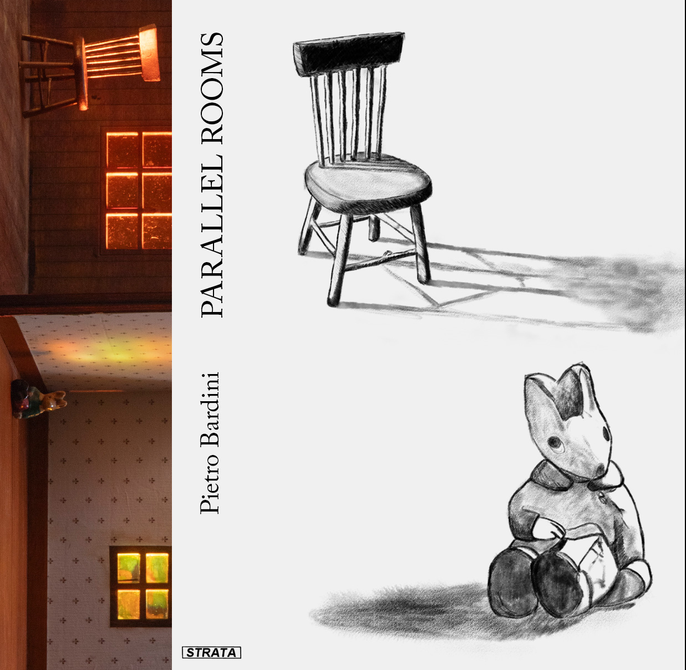
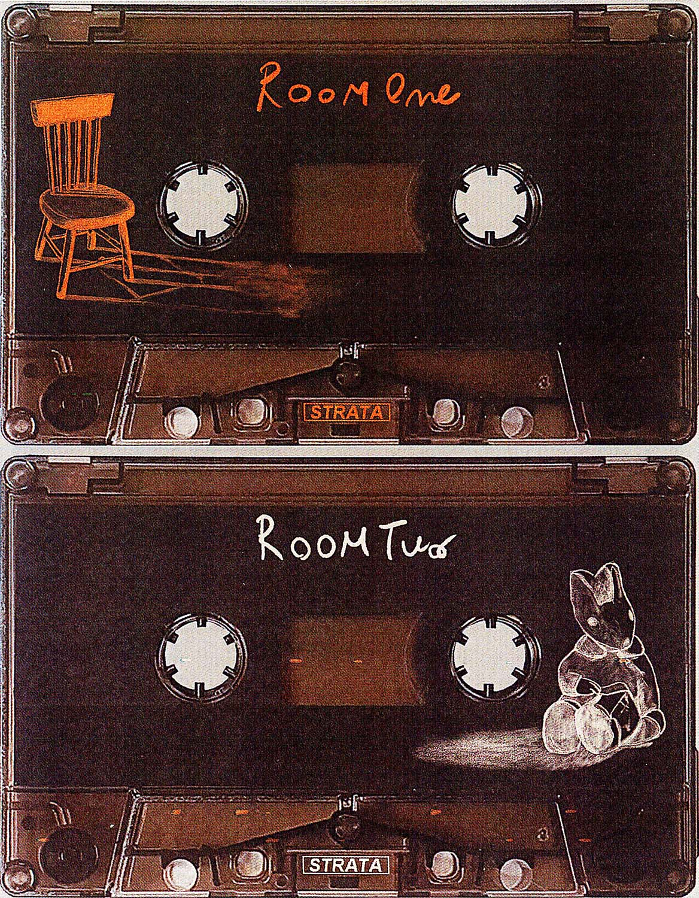

# Pietro Bardini: Parallel Rooms (DL + Cassette)

Streaming & Download link for *Parallel Rooms* on **STRATA**, for radio / press / personal enjoyment:

[Private Streaming Link (Soundcloud)](https://on.soundcloud.com/hJo3tjbgKlbsYyC57F)
[Private Download Link (WAV/FLAC/MP3)](https://drive.google.com/drive/folders/15klp8l0k-TZLjLUShbI602ow3husWpFv?usp=sharing)

### Release Date: 20.02.26 (TBC)

---

## About
Parallel Rooms is a two‑track piece composed in 2024–25 with string players from London’s free‑improvisation scene. The pieces came together by recording guided improvisations under a set of simple rules and harmonic limits, editing and layering them, then re‑amping and improvising again over those takes. The central harmonic progression of Room One acted as both the anchor and starting point.

Tying the work together was two miniature rooms: Room One, dark mahogany with an orange glow and an empty chair; Room Two, a stained‑glass window, fleur‑de‑lis wallpaper, and a small rabbit figure. These props were used during the recordings to find the atmosphere to develop the pieces upon. The idea of two parallel rooms also shaped the structure of the composition; the two pieces mirror each other harmonically with a leitmotif joining the rooms together.

The two rooms were performed separately: in March 2025 at Avalon Café and in September 2025 at Spanners within Horsehair, a series curated by Pietro focused on experimental string music.

## Album Cover
 

 
  
## Release Format
Digital + Cassette (*70-copies limited edition brown Cassettes with outer O-Cards*).
 

## Tracklist
1. Side A: Room One [18’44”]
2. Side B: Room Two [17’28”]

## Credits
Composed and Produced: *Pietro Bardini*

Violin: *Angharad Davies*
Viola:*Charis Morgan / Ariane Alexander*
Double Bass: *Caius Williams*
Cello: *Isidora Edwards*
Piano: *Pietro Bardini*

Additional Arrangments for Room One: *Tim Pottier*

Additional Mixing: *Sean Woodford*
Mastering: *Noel Summerville*

Thanks to *Maxwell Sterling* for the feedback and support.
  
## Artist Bio
Pietro Bardini is an Italian, London-based composer and artist. He works across sound composition, audio-visual performances, and installations. His works have been shown and played at Arebyte, Barbican Centre, Café OTO, Corsica Studios, The White Hotel, The Horse Hospital, IKLECTIK, Spanners, Royal College of Art, Rio Cinema Dalston, and MK Gallery. Since 2024, he co-runs the label and event series STRATA and releases music under the alias Partial Defrag, as previously covered by The Quietus and as a NINA Protocol Staff Pick.
 

 

For all enquiries, please contact: **strata.edition@gmail.com**

 

